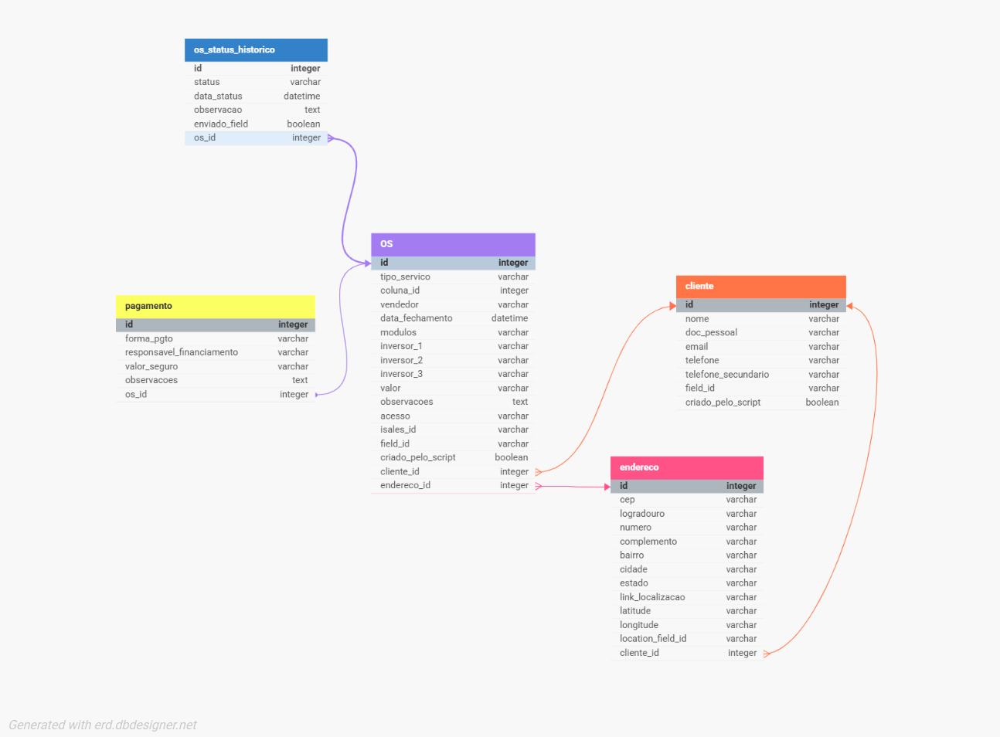

# 🚀 Integração iSales → FieldControl com Banco Local  

Integração automatizada entre o CRM **iSales** (formato Kanban) e o ERP **FieldControl**, com persistência em **banco de dados local** para controle total e histórico de mudanças.  
Elimina retrabalho, garante consistência de dados e permite auditoria completa.  

---

## 📌 Objetivo

- Automatizar a transferência de dados de **projetos aprovados e cancelados** entre sistemas.  
- Garantir que **nenhuma informação seja perdida**, mesmo em alterações de status.  
- Facilitar a auditoria, mantendo um **histórico detalhado** e possibilitando reprocessamentos.  

---

## 🧭 Fluxo do Processo

| Etapa | Script | Função |
|-------|--------|--------|
| 0️⃣ | `00_schema_banco.py` | Cria o esquema do banco de dados local (`cliente`, `endereco`, `os`, `pagamento`, `os_status_historico` etc.) |
| 1️⃣ | `01_get_projetos_isales.py` | Coleta dados de projetos via API do iSales |
| 2️⃣ | `02_tratar_dados_clientes.py` | Complementa dados com geolocalização e prepara JSON para inserção |
| 3️⃣ | `03_sync_dados_local.py` | Insere ou atualiza dados no banco local, controlando status e mudanças |
| 4️⃣ | `04_sync_field_api.py` | Envia dados para a API do FieldControl, evitando duplicações e tratando pendências |

---

## 💾 Estrutura do Banco de Dados

- **Tabelas:** `cliente`, `endereco`, `os`, `pagamento`, `os_status_historico`  
- **Registro histórico** de toda alteração de status.  
- **Regras para cancelamento**: OS de cancelamento só são criadas quando há um histórico válido anterior.  

📊 **Modelo Entidade-Relacionamento:**  

  

---

## ⚙️ Como Executar

### Pré-requisitos
- Python 3.10+
- Banco de dados SQLite ou MySQL configurado

### Passos
```bash
# Clonar repositório
git clone https://github.com/Kamilyszg/Integracao_Isales_FieldControl.git

# Entrar na pasta
cd Integracao_Isales_FieldControl

# Instalar dependências
pip install -r requirements.txt

# Criar esquema do banco
python 00_schema_banco.py

# Executar fluxo
python 01_get_projetos_isales.py
python 02_tratar_dados_clientes.py
python 03_sync_dados_local.py
python 04_sync_field_api.py
```

### 📅 Status do Projeto

✅ Concluído e em uso interno <br>
☁️ Próximos passos: Hospedar na AWS para execução escalável.

### 👩‍💻 Autoria

Kamily Gracia <br>
Desenvolvedora Júnior <br>
🔗 [LinkedIn](https://www.linkedin.com/in/kamily-de-souza-gracia/)

### 📄 Licença

Este projeto está licenciado sob a licença MIT — veja o arquivo [LICENSE](./LICENSE) para mais detalhes.

